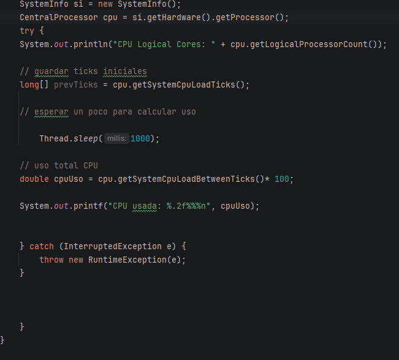
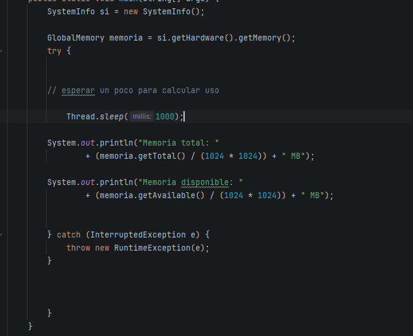

# Introduccion
Como pequeña introduccion lo que haremos en este documento sera hacer un resumen y un informe referente a como hemos creado
sacar datos del servidor, es decir, del estado de CPU, Memoria y disco duro... Primero lo que haremos sera mostrar los datos de manera individual
para ir viendo como se hara en conjunto y con una actualizacion mas constante. Lo que hemos decidido utilizar para esta ocasion es una libreria externa conocida como "oshi" para ello, en nuestro "pom.xml" en maven hemos añadido la libreria como corresponde, añadiendo las dependencias oshi.

# CPU

# Memoria

# DISCO